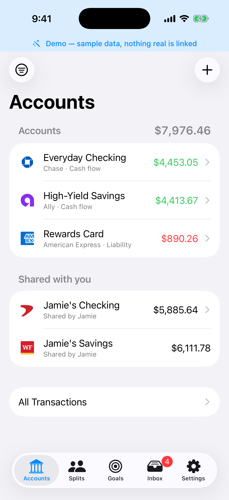
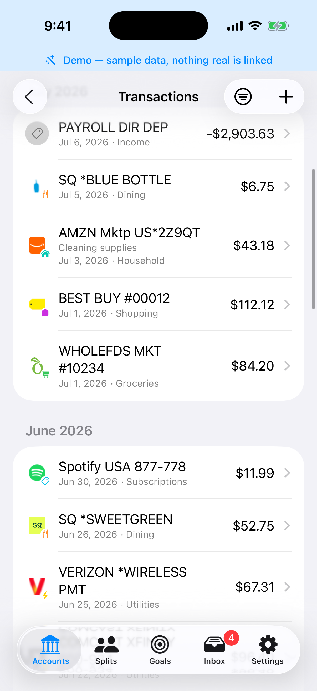
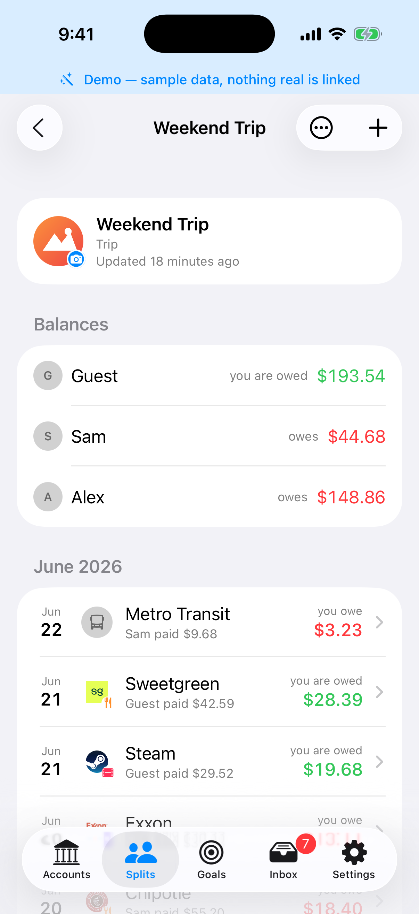
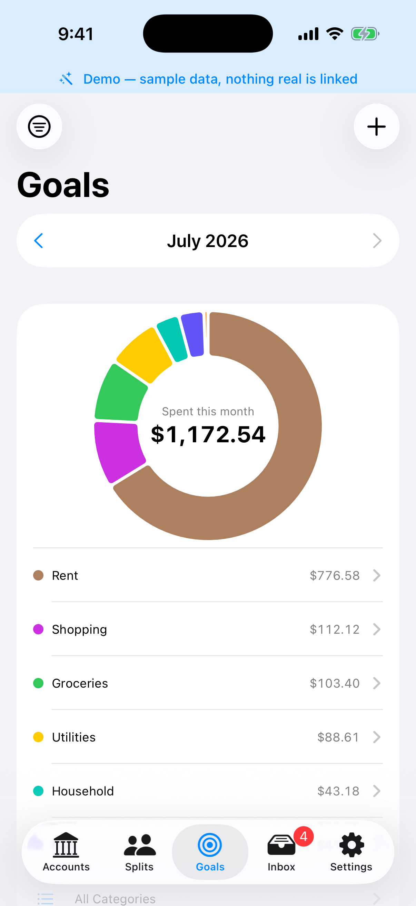

# Cleave

> *cleave (v.) - to split apart; to bind together. Rarely both at once.*

**A self-hosted, iOS-native personal-finance and expense-splitting app - a Mint × Splitwise hybrid
you actually own.**

Cleave is two apps sharing one ledger: the shared-expense app you'd use instead of Splitwise,
and the personal-finance app you'd use instead of Mint - running against a backend *you* host,
so no company sits between you and your money data. Split a dinner four ways, track your bank
accounts and card spending, scan receipts, watch budgets and subscriptions - all on
infrastructure you control, with the on-device intelligence to make it feel effortless.

<p>
  
  
  
  
  
</p>

<p align="center">
  
  
  
  
</p>

> **Status:** early and evolving. Cleave is a complete, tested stack that one household runs day
> to day - but it's for people comfortable running a container and building an app from source,
> not yet a one-tap App Store install. Issues and feedback welcome.

---

## Table of contents

- [Why Cleave](#why-cleave)
- [What's in this repo](#whats-in-this-repo)
- [What you get](#what-you-get)
- [Quick start](#quick-start)
- [How it fits together](#how-it-fits-together)
- [Security &amp; privacy](#security--privacy)
- [Backups &amp; disaster recovery](#backups--disaster-recovery)
- [Documentation](#documentation)
- [Contributing](#contributing)
- [License](#license)

---

## Why Cleave

Most money apps are a trade: you get a nice UI, they get a permanent copy of every transaction
you make. Splitwise paywalls the basics; Mint shut down; the aggregators monetize insight into
your spending. Cleave takes the other side of that trade - the polish of a native app, on
infrastructure you own.

- **📱 For everyone using it:** one app for shared expenses *and* personal finance, so a bill
  you split and the card charge that paid for it never double-count. Fast, offline-capable, and
  smart - receipt scanning, categorization, and subscription detection all happen on your phone.
- **🧑‍💻 For the person running it:** a single Docker Compose stack (Postgres + object store +
  API) behind your own tunnel. No Cleave cloud, no third-party analytics, no account to close.
  Bank tokens encrypted at rest, full-stack backups, and end-to-end-encrypted push that keeps
  Apple credentials out of the open-source core.
- **🔓 Free to leave, by construction:** import your Splitwise history and keep it in sync - or
  migrate it into self-hosted groups you own - and export everything (CSV/JSON/OFX + receipts)
  whenever you want. AGPL-licensed, so a hosted fork stays open too.

The name is a contranym: to *cleave* is both to split apart and to bind together - which is exactly
what the app does, splitting shared costs while keeping the people who share them in sync.

## What's in this repo

Cleave is a small monorepo. Each part has its own detailed README:

| Path | What it is | Docs |
| --- | --- | --- |
| [`backend/`](backend) | The self-hosted API - FastAPI · SQLAlchemy async · Postgres · MinIO. Integrations (Plaid, SimpleFIN, Splitwise, OFX), auth, backups, push. | [backend README](backend/README.md) |
| [`ios/`](ios) | The native app - SwiftUI · SwiftData · Swift 6.2, targeting iOS 26. Almost all code lives in the `CleaveAPI` Swift package. | [iOS README](ios/README.md) |
| [`relay/`](relay) | A standalone **blind push relay** that forwards notifications to Apple - the only component that holds Apple push credentials, so the core never does. | [relay README](relay/README.md) |
| [`deploy/`](deploy) | Minimal **prebuilt-image** stack (GHCR images, no build) - the easiest self-host, and the base the one-click store templates wrap. | [deploy README](deploy/README.md) |
| [`docs/`](docs) | Operations, provider setup, testing, disaster recovery. | [OPERATIONS](docs/OPERATIONS.md) · [PROVIDERS](docs/PROVIDERS.md) |
| [`docker-compose.yml`](docker-compose.yml) | Orchestrates the whole stack from source, with opt-in profiles for dev, demo, test, and ingress (Cloudflare Tunnel / Tailscale). | - |

## What you get

### 📱 For the people using the app

- **Split expenses properly** - eight split modes (equal, exact, percent, shares, adjustment,
  reimburse, **itemized**, settle-up), multi-payer, custom group avatars, and a live
  "balanced / off by $X" check. → [iOS features](ios/README.md#feature-highlights)
- **Keep your Splitwise life** - two-way sync of groups, friends, balances, and edits, or
  migrate a group onto your own server for good.
- **Track all your money** - link banks (Plaid), connect via SimpleFIN, or import OFX
  statements (Apple Card & friends), with net-worth headers and duplicate-account merge.
- **Understand your spending** - a monthly category donut, spending/net-income trends, budgets,
  savings goals, and **combined household budgets** across partners (Swift Charts, every total
  drills through to its rows).
- **Do it in seconds, privately** - scan a receipt into a prefilled expense, and let on-device
  **Apple Intelligence** categorize merchants and read receipts without anything leaving the
  phone. → [on-device intelligence](ios/README.md#on-device-intelligence)
- **Stay on top of it** - a smart suggestion inbox (link, recategorize, track a subscription,
  split "like last time"), Rocket-Money-style subscription detection, and a shared-group
  activity feed with per-category push controls.
- **Connect a partner** - link one-to-one with someone else on your server, then **share
  individual accounts or goals read-only** (balances-only or full), and run **combined household
  budgets** across both of you. Opt-in per item, always read-only.
  → [iOS → Share & collaborate](ios/README.md#share--collaborate)

### 🧑‍💻 For the person running it

- **One stack, on your box** - Postgres, MinIO (S3-compatible object storage), and the API in
  Docker Compose. → [backend architecture](backend/README.md#how-it-fits-together)
- **Reachable without opening ports** - Cloudflare Tunnel (public) or Tailscale (tailnet-private,
  or public via Funnel); the app reaches a stable HTTPS hostname, and only the API is exposed -
  the database and object storage are not tunneled. → [operating in production](backend/README.md#operating-in-production)
- **Credentials protected** - bank/Splitwise tokens are Fernet-encrypted at rest, with a startup
  check that warns if a restored DB can't decrypt them. → [security](backend/README.md#security--privacy)
- **Push without Apple keys** - notifications go through a blind relay and are end-to-end
  encrypted to each device; the open-source core holds no Apple credentials. Use the official relay
  ([push.cleave.money](https://push.cleave.money)) with the published app, or
  [run your own](backend/README.md#push-notifications--use-the-official-relay-or-run-your-own)
  if you ship your own build.
- **Full-stack backups** - Postgres dump + every receipt in one archive, with an optional
  encrypted off-device tier (restic over SFTP/S3/rclone) and a documented restore.
  → [backups & DR](backend/README.md#backups--disaster-recovery)
- **Invite-only & multi-user** - closed registration by default; the first person to claim a
  fresh server becomes admin, and everyone after redeems a **single-use invite** (mint a join
  link / QR in the app, with an optional label + expiry; revoke anytime). Members can be allowed
  to invite too. Runtime policy (sync cadence, retention, provider toggles) is admin-editable from
  the app, no redeploy. → [backend → Multi-user](backend/README.md#multi-user-invites--partner-sharing)
- **Own your data end to end** - export everything as CSV/JSON/OFX or a single ZIP with
  receipts. → [data export](backend/README.md#api)

## Quick start

Stand up the backend, expose it, then point the app at it. **~10 minutes** to a running server.

### Prerequisites

- **Docker + Docker Compose** on the host that will run the backend.
- For anything beyond a LAN test, a way for your phone to reach it: a **Cloudflare Tunnel**
  (needs a domain you control) or **Tailscale** (no domain - you get a free `.ts.net` hostname).
- To build the app: a **Mac with Xcode 26+** and [XcodeGen](https://github.com/yonaskolb/XcodeGen).

### 1 - Run the backend

Two ways, depending on whether you want to build from source:

- **Prebuilt images (easiest - no checkout, no build).** Grab
  [`deploy/docker-compose.yml`](deploy) + `deploy/.env.example`, fill in four secrets, and
  `docker compose up -d` pulls `ghcr.io/boomseklecki/cleave-api` and self-migrates. This is also the
  base the one-click store templates (**Unraid / Umbrel / CasaOS / Runtipi / Helm**) wrap. Full
  steps: [`deploy/README.md`](deploy/README.md). Then skip to step 2.
- **From source** (the dev/demo/test side-stacks, or to hack on it) - continue below.

```bash
# Clone
git clone https://github.com/boomseklecki/cleave-money.git && cd cleave-money

# Configure: copy the template, then fill in secrets
cp .env.example .env

# Generate the two secrets you must NOT lose (see Security & privacy below):
openssl rand -hex 32                                                        # -> AUTH_JWT_SECRET
python3 -c "from cryptography.fernet import Fernet; print(Fernet.generate_key().decode())"  # -> ENCRYPTION_KEYS
# Also set ADMIN_USERS and any provider creds you want (Apple/Google/Splitwise/Plaid).

# Bring up the core stack. The API self-migrates on start (runs `alembic upgrade head`),
# so it's ready after this one command - no separate migration step.
docker compose up -d db api minio

# Verify (the API listens on the internal network, so check from inside the container)
docker compose exec api curl -s localhost:8000/health        # -> {"status":"ok"}
docker compose exec api curl -s localhost:8000/server-info   # capability discovery
```

> Out of the box the stack boots with **LAN-safe dev defaults** (dev DB/MinIO passwords), so you
> can try it immediately - but set strong secrets and `ALLOWED_HOSTS` **before** exposing it
> publicly. Push notifications are optional (`docker compose up -d relay` adds the relay).
> Full config reference: [backend README → Configuration](backend/README.md#configuration).

### 2 - Expose it

Pick one and follow [docs/OPERATIONS.md → Public / remote access](docs/OPERATIONS.md):

- **Cloudflare Tunnel** - `docker compose --profile tunnel up -d cloudflared` (public HTTPS at
  your domain).
- **Tailscale** - `docker compose --profile tailscale up -d tailscale` (private to your tailnet;
  no domain required).

### 3 - Build the app & point it at your backend

```bash
cd ios
xcodegen generate      # the .xcodeproj isn't committed; it's generated from project.yml
open Cleave.xcodeproj  # select the Cleave scheme + a simulator or device, then Run
```

On the sign-in screen, enter your backend's URL (its public hostname, or its **LAN IP** - not
`localhost`) and sign in with Apple, Google, or Splitwise. You can switch servers at runtime, so
you don't rebuild to change backends. → [iOS README → Build & run](ios/README.md#build--run)

> **Onboarding a community? Point them at the published Cleave app.** The easiest path - for you and
> your users - will be to have them install Cleave from the App Store and enter your backend's URL; no
> Apple Developer account, no sideloading. Splitwise, demo, and bearer-token sign-in work as-is; for
> Apple/Google sign-in the operator sets the backend's audiences to the published app's public values,
> and joining is by paste/QR. **Building and shipping your own app** is the advanced, full white-label
> path (your own bundle id and working Universal Links to your domain). Details:
> [iOS → Two ways to run the app](ios/README.md#connecting-to-a-backend).
>
> ⚠️ **The App Store listing isn't live yet.** Until it ships, everyone builds from source (below /
> [iOS → Build & run](ios/README.md#build--run)); the published-app flow above is how onboarding will
> work once it's listed.

### Optional - try the app with sample data first

Set `DEMO_MODE=true` on your backend to enable a **name-only guest login** that auto-seeds
isolated sample data, so you (or testers you invite) can explore a populated app before linking
real accounts. It 404s while off, so it's safe to leave disabled on your real instance.
→ [docs/OPERATIONS.md → Demo / public instance](docs/OPERATIONS.md)

## How it fits together

```
                         ┌──────────────────────────────────┐
   iPhone  ── HTTPS ────▶│  Cloudflare Tunnel / Tailscale     │   (stable hostname; no open ports)
   (Cleave app)          └─────────────────┬──────────────────┘
                                           ▼
   ┌──────────────────────────────── api (FastAPI) ──────────────────────────────┐
   │  expenses · splits · accounts · transactions · balances · goals · budgets ·  │
   │  categories · receipts · notifications · backups · export · server-settings  │
   └──────┬──────────────────┬─────────────────────┬──────────────────┬──────────┘
          ▼                  ▼                     ▼                  ▼
    Postgres 16           MinIO             push relay ─▶ APNs    external APIs
    (relational)       (receipts, avatars,  (blind: only          (Plaid · SimpleFIN ·
                        logos, backups)      ciphertext)           Splitwise · logos)

   The app does its own thinking on-device (analytics, categorization, receipt OCR,
   subscription detection) and treats its local SwiftData store as a disposable cache;
   the backend is the source of truth. Backend and app deliberately share category,
   brand, and split/balance logic so their numbers always agree.
```

More detail: [backend architecture](backend/README.md#how-it-fits-together) ·
[iOS architecture](ios/README.md#architecture).

## Security & privacy

Security is the reason to self-host, so it's treated as a feature - on both sides:

- **🧑‍💻 Tokens encrypted at rest.** Plaid/Splitwise access tokens are Fernet-encrypted in the
  database (keys rotate; a DB leak exposes only ciphertext).
- **📱 On-device AI, no uploads.** Receipt reading and smart categorization use Apple's
  on-device model - your receipts and transactions never go to a cloud model.
- **🔒 End-to-end-encrypted push.** Notification content is encrypted to each device's key; the
  relay and Apple only ever see ciphertext and a generic "New activity" placeholder, decrypted
  on-device by a notification extension.
- **🧑‍💻 No open ports.** The backend is reached only through a tunnel; the database is never
  exposed. (The from-source compose publishes MinIO's console to the host for convenience; the
  prebuilt `deploy/` stack keeps MinIO internal.)
- **📱 Per-server sessions + Face ID.** The app stores each backend's token separately in the
  Keychain and can lock behind Face ID / passcode.

**Two secrets you must escrow off-host** (they are deliberately *not* in any backup):
`AUTH_JWT_SECRET` and `ENCRYPTION_KEYS` - losing the latter means users must re-link their banks.
Details: [backend → Security](backend/README.md#security--privacy) ·
[iOS → Privacy](ios/README.md#privacy--security).

## Backups & disaster recovery

A backup is a complete, restorable snapshot - a Postgres dump plus every receipt object - in one
archive. Scheduled + manual backups with retention, an optional encrypted off-device tier
(restic to a NAS/S3/rclone remote), and an atomic restore that takes a safety backup first.
Full procedure, including SFTP/Synology setup: [docs/DISASTER_RECOVERY.md](backend/docs/DISASTER_RECOVERY.md)
and [backend → Backups](backend/README.md#backups--disaster-recovery).

## Documentation

| Doc | For |
| --- | --- |
| [backend/README.md](backend/README.md) | Running, configuring, and understanding the API |
| [ios/README.md](ios/README.md) | Building the app and how it works on-device |
| [relay/README.md](relay/README.md) | Running your own push relay (self-built app / community) |
| [docs/OPERATIONS.md](docs/OPERATIONS.md) | Reverse proxy / tunnel, push relay, demo, backups |
| [docs/PROVIDERS.md](docs/PROVIDERS.md) | Apple / Google / Splitwise / Plaid setup |
| [docs/TESTING.md](docs/TESTING.md) | Test suites and how they run |
| [backend/docs/DISASTER_RECOVERY.md](backend/docs/DISASTER_RECOVERY.md) | Restore + off-device backup setup |

## Contributing

Issues and pull requests are welcome. Because Cleave handles financial data - and because the app
and backend deliberately mirror each other's category, brand, and split/balance logic - changes
to those areas should come with tests; the parity tests exist precisely so the two can't silently
diverge. `bash scripts/test-all.sh` runs every suite (relay + backend) - it's exactly what CI runs;
the iOS suite builds in Xcode. See each side's README for the per-suite detail.

Before opening a PR, please read [CONTRIBUTING.md](CONTRIBUTING.md) (dev setup, tests, and the
sign-off requirement) and our [Code of Conduct](CODE_OF_CONDUCT.md). Security issues:
[SECURITY.md](SECURITY.md). How Cleave handles data: [PRIVACY.md](PRIVACY.md).

## License

[GNU Affero General Public License v3.0](LICENSE). If you run a modified Cleave as a network
service, the AGPL requires you to offer your users the modified source.

---

